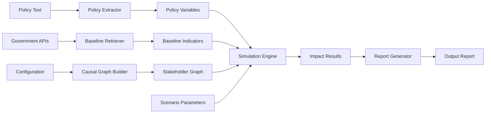

# Design Document: Policy Consequence Simulator

## Overview

The NitiVimarsh AI Policy Consequence Simulator is a modular system that transforms policy text into quantified impact predictions across stakeholder groups. The architecture follows a pipeline pattern with five core components:

1. **Policy Extractor** - NLP-based parser for structured variable extraction
2. **Baseline Retriever** - Data fetcher with caching and validation
3. **Causal Graph Builder** - Graph construction engine with configurable relationships
4. **Simulation Engine** - Monte Carlo-based impact calculator
5. **Report Generator** - Multi-format output with visualizations

The system uses a directed acyclic graph (DAG) to model stakeholder relationships, where nodes represent stakeholders and edges represent causal influence. The simulation engine propagates policy shocks through this graph using scenario parameters to compute ripple effects.

## Architecture

### High-Level Architecture



### Component Interaction Flow

1. User provides policy text and scenario parameters
2. Policy Extractor parses text into structured variables
3. Baseline Retriever fetches current economic indicators
4. Causal Graph Builder constructs stakeholder relationship model
5. Simulation Engine runs Monte Carlo simulations with scenario parameters
6. Report Generator produces explainable output with visualizations

### Technology Stack Considerations

- **NLP Processing**: Regular expressions with pattern matching for MVP, extensible to transformer models
- **Data Retrieval**: HTTP client with retry logic and caching
- **Graph Modeling**: Adjacency list representation with weighted edges
- **Simulation**: Monte Carlo method with configurable iterations (default: 1000)
- **Visualization**: Chart generation library for trade-off plots
- **Output Formats**: JSON (structured data), HTML (interactive), PDF (printable)

## Components and Interfaces

### Policy Extractor

**Responsibility**: Parse policy text and extract structured variables

**Interface**:
```
extract_policy_variables(policy_text: String) -> Result<PolicyVariables, ExtractionError>
```

**PolicyVariables Structure**:
- `policy_type`: Enum (SubsidyChange, TaxChange, CreditIncentive)
- `target_group`: List<Stakeholder>
- `parameters`: Map<String, Float> (e.g., {"subsidy_reduction_percent": 20.0})
- `timeline`: Timeline (start_date, end_date, phases)

**Extraction Strategy**:
- Pattern matching for policy type keywords (subsidy, tax, credit, incentive)
- Named entity recognition for target groups (citizen, MSME, farmer)
- Numerical extraction for parameters (percentages, amounts, dates)
- Timeline parsing for implementation phases

**Error Handling**:
- Return `ExtractionError` with specific missing field information
- Provide confidence scores for extracted values

### Baseline Retriever

**Responsibility**: Fetch and validate economic indicators from government sources

**Interface**:
```
retrieve_baseline_data(indicators: List<String>) -> Result<BaselineData, RetrievalError>
```

**BaselineData Structure**:
- `indicators`: Map<String, IndicatorValue>
- `metadata`: DataMetadata (source, timestamp, confidence)

**IndicatorValue Structure**:
- `value`: Float
- `unit`: String
- `source`: String
- `timestamp`: DateTime
- `confidence`: Float (0.0 to 1.0)

**Data Sources** (MVP):
- Reserve Bank of India (RBI) API for inflation, interest rates
- Ministry of Statistics API for GDP, employment
- Fallback to cached/mock data if APIs unavailable

**Caching Strategy**:
- Cache baseline data with TTL (Time To Live) of 24 hours
- Validate data recency before use
- Store metadata for audit trail

### Causal Graph Builder

**Responsibility**: Construct stakeholder relationship graph with weighted edges

**Interface**:
```
build_causal_graph(config: GraphConfig) -> CausalGraph
```

**CausalGraph Structure**:
- `nodes`: List<StakeholderNode>
- `edges`: List<CausalEdge>

**StakeholderNode**:
- `id`: String
- `stakeholder_type`: Enum (Citizen, MSME, Farmer, Government)
- `attributes`: Map<String, Any>

**CausalEdge**:
- `source`: String (node id)
- `target`: String (node id)
- `weight`: Float (0.0 to 1.0, representing influence strength)
- `relationship_type`: String (e.g., "tax_burden", "subsidy_benefit")

**MVP Graph Structure**:
```
Government --[subsidy]--> Citizen
Government --[subsidy]--> MSME
Government --[tax]--> Citizen
Government --[tax]--> MSME
Government --[credit_policy]--> MSME
MSME --[employment]--> Citizen
Farmer --[food_prices]--> Citizen
```

**Validation**:
- Check for cycles (warn if present, as they indicate feedback loops)
- Ensure all stakeholder types are represented
- Validate edge weights are in valid range [0.0, 1.0]

### Simulation Engine

**Responsibility**: Compute policy impact across stakeholders using scenario-based simulation

**Interface**:
```
simulate_policy_impact(
    policy_vars: PolicyVariables,
    baseline: BaselineData,
    graph: CausalGraph,
    scenario: ScenarioParameters
) -> SimulationResult
```

**ScenarioParameters**:
- `elasticity`: Float (price/demand responsiveness, default: 0.5)
- `adoption_rate`: Float (0.0 to 1.0, default: 0.7)
- `compliance_rate`: Float (0.0 to 1.0, default: 0.8)
- `pass_through_rate`: Float (0.0 to 1.0, default: 0.6)
- `simulation_iterations`: Int (default: 1000)

**SimulationResult**:
- `shock_indices`: Map<Stakeholder, ShockIndex>
- `before_state`: Map<Stakeholder, StateMetrics>
- `after_state`: Map<Stakeholder, StateMetrics>
- `uncertainty`: Map<Stakeholder, UncertaintyMetrics>

**ShockIndex**:
- `value`: Float (magnitude of impact, can be positive or negative)
- `direction`: Enum (Positive, Negative, Neutral)
- `confidence`: Float (0.0 to 1.0)

**StateMetrics**:
- `income_level`: Float
- `cost_burden`: Float
- `benefit_received`: Float

**UncertaintyMetrics**:
- `std_deviation`: Float
- `confidence_interval`: (Float, Float)
- `sensitivity`: Map<String, Float> (parameter -> impact sensitivity)

**Simulation Algorithm**:
1. Initialize stakeholder states with baseline data
2. Apply policy shock to directly affected stakeholders
3. Propagate impact through causal graph edges using weights
4. Apply scenario parameters (elasticity, adoption, compliance, pass-through)
5. Run Monte Carlo iterations with parameter variations
6. Aggregate results and compute statistics (mean, std dev, confidence intervals)
7. Calculate shock index as normalized impact magnitude

**Impact Propagation Formula**:
```
impact_on_target = source_impact × edge_weight × pass_through_rate × compliance_rate
```

### Report Generator

**Responsibility**: Produce explainable, multi-format reports with visualizations

**Interface**:
```
generate_report(result: SimulationResult, format: OutputFormat) -> Report
```

**OutputFormat**: Enum (JSON, HTML, PDF)

**Report Structure**:
- **Executive Summary**: Key findings and overall impact assessment
- **Shock Index Table**: Stakeholder-wise impact magnitudes
- **Trade-off Visualization**: Chart comparing stakeholder impacts
- **Scenario Comparison**: Before vs after metrics
- **Uncertainty Analysis**: Confidence intervals and sensitivity analysis
- **Methodology Explanation**: How shock indices were calculated
- **Data Sources**: Baseline data sources and timestamps

**Visualization Components**:
- Bar chart: Shock indices by stakeholder
- Scatter plot: Trade-offs (e.g., government savings vs citizen burden)
- Line chart: Impact propagation over time (if timeline has phases)
- Heatmap: Sensitivity analysis (parameter variations vs impact)

**Explainability Features**:
- Step-by-step calculation breakdown for each shock index
- Causal path highlighting (which edges contributed most to impact)
- Parameter sensitivity ranking (which scenario parameters matter most)

## Data Models

### PolicyVariables

```
PolicyVariables {
    policy_type: PolicyType,
    target_group: List<Stakeholder>,
    parameters: Map<String, Float>,
    timeline: Timeline
}

PolicyType = SubsidyChange | TaxChange | CreditIncentive

Stakeholder = Citizen | MSME | Farmer | Government

Timeline {
    start_date: Date,
    end_date: Date,
    phases: List<Phase>
}

Phase {
    name: String,
    start_date: Date,
    parameter_adjustments: Map<String, Float>
}
```

### BaselineData

```
BaselineData {
    indicators: Map<String, IndicatorValue>,
    metadata: DataMetadata
}

IndicatorValue {
    value: Float,
    unit: String,
    source: String,
    timestamp: DateTime,
    confidence: Float
}

DataMetadata {
    retrieval_timestamp: DateTime,
    sources: List<String>,
    overall_confidence: Float
}
```

### CausalGraph

```
CausalGraph {
    nodes: List<StakeholderNode>,
    edges: List<CausalEdge>
}

StakeholderNode {
    id: String,
    stakeholder_type: Stakeholder,
    attributes: Map<String, Any>
}

CausalEdge {
    source: String,
    target: String,
    weight: Float,
    relationship_type: String
}
```

### SimulationResult

```
SimulationResult {
    shock_indices: Map<Stakeholder, ShockIndex>,
    before_state: Map<Stakeholder, StateMetrics>,
    after_state: Map<Stakeholder, StateMetrics>,
    uncertainty: Map<Stakeholder, UncertaintyMetrics>,
    scenario_used: ScenarioParameters
}

ShockIndex {
    value: Float,
    direction: ImpactDirection,
    confidence: Float
}

ImpactDirection = Positive | Negative | Neutral

StateMetrics {
    income_level: Float,
    cost_burden: Float,
    benefit_received: Float
}

UncertaintyMetrics {
    std_deviation: Float,
    confidence_interval: (Float, Float),
    sensitivity: Map<String, Float>
}
```

### Configuration

```
SystemConfig {
    data_sources: DataSourceConfig,
    graph_config: GraphConfig,
    simulation_config: SimulationConfig,
    output_config: OutputConfig
}

DataSourceConfig {
    rbi_api_url: String,
    statistics_api_url: String,
    cache_ttl_hours: Int,
    timeout_seconds: Int
}

GraphConfig {
    stakeholder_types: List<Stakeholder>,
    default_edges: List<EdgeDefinition>,
    validation_rules: ValidationRules
}

EdgeDefinition {
    source: Stakeholder,
    target: Stakeholder,
    weight: Float,
    relationship_type: String
}

SimulationConfig {
    default_iterations: Int,
    default_elasticity: Float,
    default_adoption_rate: Float,
    default_compliance_rate: Float,
    default_pass_through_rate: Float
}

OutputConfig {
    supported_formats: List<OutputFormat>,
    default_format: OutputFormat,
    visualization_settings: VisualizationSettings
}
```

## Correctness Properties

A property is a characteristic or behavior that should hold true across all valid executions of a system—essentially, a formal statement about what the system should do. Properties serve as the bridge between human-readable specifications and machine-verifiable correctness guarantees.

### Property 1: Policy Extraction Completeness

*For any* valid policy document, the Policy_Extractor should extract all required fields (policy type, target group, parameters, timeline) and return a complete PolicyVariables structure.

**Validates: Requirements 1.1, 1.2, 1.3, 1.4**

### Property 2: Malformed Policy Error Handling

*For any* malformed or incomplete policy text, the Policy_Extractor should return a descriptive error indicating which specific fields are missing or invalid.

**Validates: Requirements 1.5**

### Property 3: Baseline Data Metadata Completeness

*For any* successfully retrieved baseline data, the result should include complete metadata (source, timestamp, confidence level) for all indicators.

**Validates: Requirements 2.1, 2.4**

### Property 4: Baseline Data Validation

*For any* retrieved baseline data, the Baseline_Retriever should validate completeness and recency, rejecting stale or incomplete data with appropriate error messages.

**Validates: Requirements 2.2, 7.2**

### Property 5: Data Source Error Handling

*For any* unavailable data source, the Baseline_Retriever should return an error that specifically identifies which source is unavailable.

**Validates: Requirements 2.3**

### Property 6: Causal Graph Structure Completeness

*For any* graph configuration, the Causal_Graph_Builder should create a complete graph with nodes for all stakeholder types, directed edges with valid weights (0.0 to 1.0), and proper relationship types.

**Validates: Requirements 3.1, 3.2, 3.3**

### Property 7: Graph Serialization Round-Trip

*For any* valid causal graph, serializing then deserializing should produce an equivalent graph structure with identical nodes, edges, and weights.

**Validates: Requirements 3.4**

### Property 8: Graph Validation Accuracy

*For any* causal graph, the validation function should correctly identify cycles and disconnected components when present, and approve valid graphs.

**Validates: Requirements 3.5**

### Property 9: Simulation Input Acceptance

*For any* complete set of inputs (policy variables, baseline indicators, causal graph, scenario parameters), the Simulation_Engine should accept them and produce results without input-related errors.

**Validates: Requirements 4.1**

### Property 10: Simulation Stakeholder Coverage

*For any* simulation with a causal graph containing N stakeholders, the simulation results should include computed impacts (shock indices, before/after states) for all N stakeholders.

**Validates: Requirements 4.2, 4.4, 4.5**

### Property 11: Scenario Parameter Sensitivity

*For any* policy simulation, varying scenario parameters (elasticity, adoption rate, compliance rate, pass-through rate) should produce measurably different shock indices, demonstrating that parameters are actually applied.

**Validates: Requirements 4.3**

### Property 12: Multiple Scenario Support

*For any* policy with fixed variables and baseline data, running simulations with different scenario parameters should produce independent results without interference.

**Validates: Requirements 4.6**

### Property 13: Report Content Completeness

*For any* simulation result, the generated report should include all required components: shock indices for each stakeholder, trade-off visualizations, uncertainty indicators, scenario comparison data, and calculation explanations.

**Validates: Requirements 5.1, 5.2, 5.3, 5.4, 5.5**

### Property 14: Invalid Input Rejection

*For any* invalid input (malformed policy text, out-of-range scenario parameters, invalid numerical values), the system should reject the input with a descriptive error message specifying what is invalid and why.

**Validates: Requirements 7.1, 7.3, 7.5**

### Property 15: Simulation Error Diagnostics

*For any* simulation that fails during execution, the system should log the error and provide diagnostic information that helps identify the failure cause.

**Validates: Requirements 7.4**

### Property 16: Configuration Validation

*For any* configuration update, the system should validate the new configuration before applying it, rejecting invalid configurations with specific error messages.

**Validates: Requirements 8.4**

## Error Handling

### Error Categories

1. **Input Validation Errors**
   - Malformed policy text
   - Missing required fields
   - Out-of-range parameters
   - Invalid numerical types

2. **Data Retrieval Errors**
   - Unavailable data sources
   - Network timeouts
   - Stale or incomplete data
   - Authentication failures

3. **Simulation Errors**
   - Invalid graph structure
   - Numerical instability
   - Convergence failures
   - Resource exhaustion

4. **Output Generation Errors**
   - Unsupported format
   - Visualization rendering failures
   - File system errors

### Error Handling Strategy

**Validation-First Approach**:
- Validate all inputs before processing
- Fail fast with descriptive error messages
- Provide actionable guidance for fixing errors

**Graceful Degradation**:
- Use cached data if live sources unavailable
- Reduce simulation iterations if resource-constrained
- Generate partial reports if some components fail

**Error Context**:
- Include relevant context in error messages (which field, what value, why invalid)
- Log full error traces for debugging
- Provide error codes for programmatic handling

**Recovery Mechanisms**:
- Retry logic for transient network failures (exponential backoff)
- Fallback to default values for optional parameters
- Alternative data sources if primary source fails

### Example Error Messages

```
ExtractionError: "Failed to extract policy type. Expected keywords: 'subsidy', 'tax', 'credit', 'incentive'. Found: 'regulation'."

RetrievalError: "Data source unavailable: RBI API (https://api.rbi.org.in). Timeout after 30 seconds. Using cached data from 2024-01-15."

ValidationError: "Scenario parameter 'adoption_rate' out of valid range. Provided: 1.5, Valid range: [0.0, 1.0]."

SimulationError: "Simulation failed: Numerical instability detected in iteration 247. Stakeholder 'MSME' impact exceeded bounds. Consider reducing elasticity parameter."
```

## Testing Strategy

### Dual Testing Approach

The system requires both unit testing and property-based testing for comprehensive coverage:

- **Unit tests**: Verify specific examples, edge cases, and error conditions
- **Property tests**: Verify universal properties across all inputs

Together, these approaches provide comprehensive coverage where unit tests catch concrete bugs and property tests verify general correctness.

### Unit Testing

**Focus Areas**:
- Specific example policies (fuel subsidy, tax slab, MSME credit)
- Edge cases (empty inputs, boundary values, extreme parameters)
- Error conditions (malformed data, unavailable sources, invalid configurations)
- Integration points between components

**Example Unit Tests**:
- Test fuel subsidy policy extraction with known policy text
- Test graph construction with specific stakeholder configuration
- Test simulation with zero elasticity (no ripple effects)
- Test report generation in each supported format (JSON, HTML, PDF)
- Test error handling when data source returns 404
- Test configuration validation with invalid URL format

### Property-Based Testing

**Testing Library**: Use a property-based testing library appropriate for the implementation language (e.g., Hypothesis for Python, fast-check for TypeScript/JavaScript, QuickCheck for Haskell).

**Configuration**:
- Minimum 100 iterations per property test
- Each test must reference its design document property
- Tag format: **Feature: policy-consequence-simulator, Property {number}: {property_text}**

**Property Test Implementation**:

Each correctness property listed above must be implemented as a single property-based test. The test should:

1. Generate random valid inputs using appropriate generators
2. Execute the system component with those inputs
3. Assert that the property holds for the outputs
4. Report any counterexamples found

**Example Property Test Structure**:

```
# Feature: policy-consequence-simulator, Property 1: Policy Extraction Completeness
def test_policy_extraction_completeness(random_policy_document):
    # Generate random valid policy document
    policy_text = generate_valid_policy_text()
    
    # Extract variables
    result = extract_policy_variables(policy_text)
    
    # Assert all required fields present
    assert result.is_ok()
    vars = result.unwrap()
    assert vars.policy_type is not None
    assert len(vars.target_group) > 0
    assert len(vars.parameters) > 0
    assert vars.timeline is not None
```

**Generators Required**:
- Policy text generator (with configurable completeness)
- Baseline data generator (with configurable staleness)
- Causal graph generator (with configurable structure)
- Scenario parameter generator (with configurable ranges)
- Simulation result generator (for testing report generation)

**Edge Case Handling in Generators**:
- Include empty strings, whitespace-only strings
- Include boundary values (0.0, 1.0 for rates)
- Include very large and very small numbers
- Include special characters and non-ASCII text
- Include malformed dates and invalid formats

### Integration Testing

**End-to-End Scenarios**:
- Complete pipeline: policy text → extraction → baseline retrieval → graph building → simulation → report generation
- Test with all three MVP example policies
- Test with various scenario parameter combinations
- Test with simulated data source failures and recovery

**Performance Testing**:
- Measure simulation time with varying iteration counts
- Test with large causal graphs (10+ stakeholders, 50+ edges)
- Test concurrent simulations
- Monitor memory usage during Monte Carlo iterations

### Test Data

**MVP Example Policies**:

1. **Fuel Subsidy Reduction**
   - Policy type: SubsidyChange
   - Target: Citizen, MSME
   - Parameter: subsidy_reduction_percent = 20.0
   - Expected impact: Negative shock for citizens, mixed for MSME

2. **Tax Slab Adjustment**
   - Policy type: TaxChange
   - Target: Citizen
   - Parameter: tax_rate_increase_percent = 5.0, income_threshold = 1000000
   - Expected impact: Negative shock for high-income citizens, positive for government

3. **MSME Credit Incentive**
   - Policy type: CreditIncentive
   - Target: MSME
   - Parameter: interest_rate_reduction_percent = 2.0, loan_amount_increase_percent = 15.0
   - Expected impact: Positive shock for MSME, indirect positive for citizens (employment)

**Mock Data Sources**:
- Provide mock baseline data for testing without external API dependencies
- Include realistic values for GDP, inflation, employment rates
- Support configurable availability (simulate failures)

### Continuous Validation

- Run property tests on every commit (CI/CD integration)
- Monitor test execution time (flag slow tests)
- Track property test failure rates
- Maintain test coverage metrics (aim for >80% code coverage)
